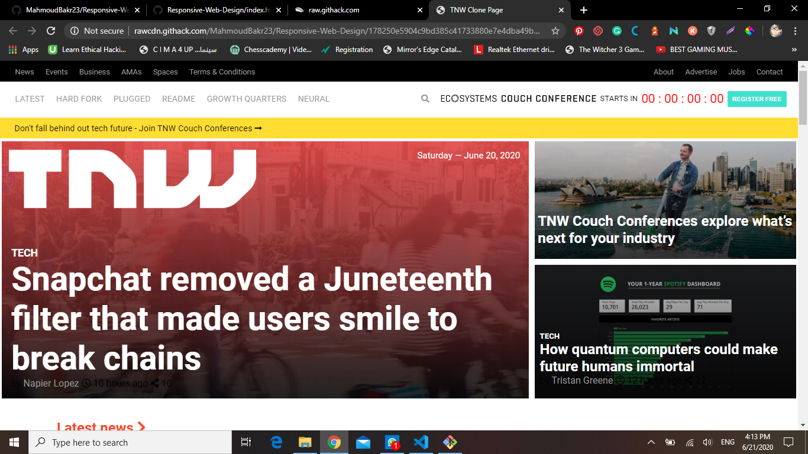

# RESPONSIVE WEB DESIGN
PROJECT: The Next Web Website Clone

**This is a clone of The Next Web website**

## Built With

- HTML
- CSS3

[Live Demo Link](https://rawcdn.githack.com/MahmoudBakr23/Responsive-Web-Design/c1d790b34a42aa843d7ac39f603cd55886621ae7/index.html)

## Getting Started

**1) Clone this Github repository.**

## Authors

👤 **Author1**

- Github: [@MahmoudBakr23](https://github.com/MahmoudBakr23)
- LinkedIn: [Mahmoud Bakr](https://www.linkedin.com/in/mahmoud-bakr-a76323194/)
- Gmail: mbakr6821@gmail.com

👤 **Author2**

- Github: [@Abidoyinsola1](https://github.com/Abidoyinsola1)
- Twitter: [@Abidoyinsola](https://twitter.com/abidoyinsola)
- LinkedIn: [Doyinsola Abiola Adeyemi](https://www.linkedin.com/in/doyinsola-adeyemi)

## 🤝 Contributing

Contributions, issues and feature requests are welcome!

## Show your support

Give a ⭐️ if you like this project!